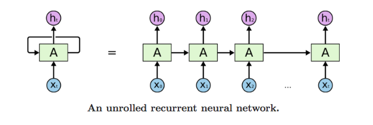
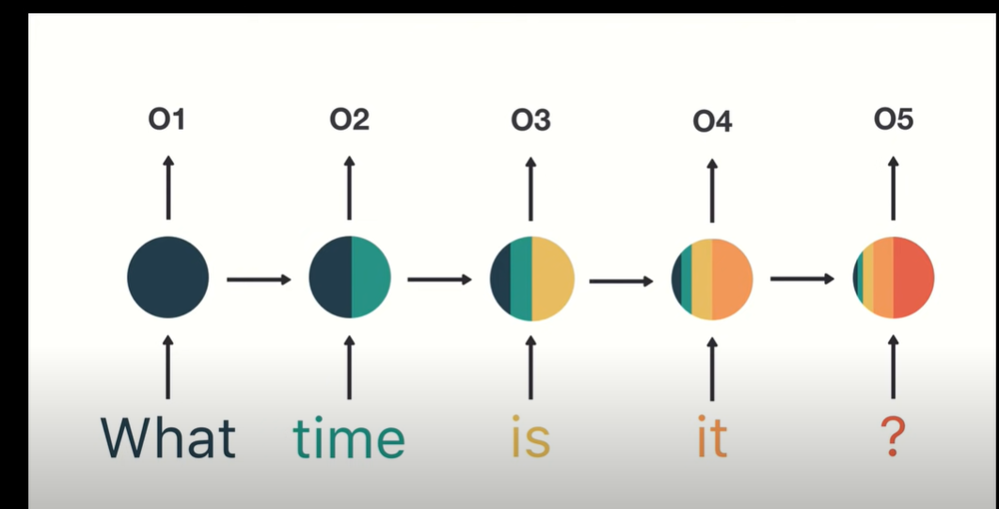

# LSTM Test Files

**Quick note:** This is just some test code to see if we want to use LSTM for our project. Not part of the final thing - will delete in a day or two.

## What's this for?

Testing out LSTM neural networks on financial data to see if they're worth using in our main project. Basic question: are they too complicated or do they work well enough to bother with?

**Context:** LSTM isn't covered in our 4661 class, but the professor recommended it specifically for predicting AQS (Air Quality System) data because air quality is mostly dependent on previous values - it's a time series problem. We're testing it on financial data first since it's similar (stock prices also depend heavily on historical values).

## Files to check out

- `lstm_tutorial.ipynb` - Basic LSTM stuff (15 min)
- `financial_lstm_prediction.ipynb` - The main test with stock data (30 min)
- `interactive_financial_lstm.py` - Fancy version with lots of options (15 min)

Total time: about an hour to get through everything

## What is LSTM?

**Long Short-Term Memory (LSTM)** is a type of neural network designed for sequence data like time series. Unlike regular neural networks that treat each input independently, LSTM can "remember" previous inputs.

**Why LSTM for time series?**

- Regular models see each data point separately: [today's temp, yesterday's temp, day before...]
- LSTM sees the sequence as connected: today's temp → depends on → yesterday's temp → depends on → day before...
- Perfect for air quality data where today's pollution depends heavily on yesterday's conditions

**Key LSTM Parameters:**

- **Hidden Size**: How much "memory" the model has (32, 64, 128, etc.) - bigger = more complex patterns
- **Number of Layers**: How many LSTM layers to stack (1-3 usually) - more = deeper understanding
- **Sequence Length**: How many previous time steps to look at (30, 60 days) - longer = more history
- **Learning Rate**: How fast the model learns (0.001 typical) - too high = unstable, too low = slow
- **Batch Size**: How many sequences to process at once (32 typical) - affects training speed
- **Dropout**: Prevents overfitting by randomly ignoring some connections (0.2 = ignore 20%)

**For our project:** Focus on tweaking these parameters rather than understanding the internal math. Start with standard values (hidden=64, layers=2, learning_rate=0.001) and experiment from there.

## Hyperparameter Effects Guide

Understanding how each parameter affects your model's performance:

### Hidden Size (32, 64, 128, 256, 512, 1024)

**Increasing Hidden Size:**

- ✅ **Training Accuracy**: Higher (can learn more complex patterns)
- ⚠️ **Generalization**: May decrease (risk of overfitting)
- 📈 **Training Time**: Significantly longer (more parameters to train)
- 💾 **Memory Usage**: Much higher
- **Sweet Spot**: 64-128 for most problems, 256+ only if you have lots of data

### Number of Layers (1, 2, 3, 4)

**Increasing Layers:**

- ✅ **Pattern Recognition**: Better for complex relationships
- ⚠️ **Overfitting Risk**: Higher (especially with small datasets)
- 📈 **Training Time**: Longer (deeper network)
- 🎯 **Diminishing Returns**: More than 3 layers rarely helps
- **Sweet Spot**: 2 layers for most time series problems

### Sequence Length (10, 30, 60, 120 days)

**Increasing Sequence Length:**

- ✅ **Long-term Patterns**: Can capture seasonal/cyclical trends
- ⚠️ **Training Difficulty**: Harder to train, may not converge
- 📈 **Training Time**: Longer (more data per sample)
- 💾 **Memory Usage**: Higher
- **Sweet Spot**: 30-60 for daily data, depends on your data's patterns

### Learning Rate (0.1, 0.01, 0.001, 0.0001)

**Higher Learning Rate (0.01-0.1):**

- ✅ **Training Speed**: Faster convergence
- ⚠️ **Stability**: May overshoot optimal solution, unstable training
- **Lower Learning Rate (0.0001-0.001):**
- ✅ **Stability**: Smooth, stable training
- ⚠️ **Training Speed**: Much slower to converge
- **Sweet Spot**: 0.001 as starting point, reduce if training is unstable

### Batch Size (8, 16, 32, 64, 128)

**Increasing Batch Size:**

- ✅ **Training Speed**: Faster (better GPU utilization)
- ✅ **Stability**: More stable gradient updates
- ⚠️ **Generalization**: May decrease (less noisy gradients)
- 💾 **Memory Usage**: Higher
- **Sweet Spot**: 32-64 for most problems

### Dropout (0.0, 0.1, 0.2, 0.3, 0.5)

**Increasing Dropout:**

- ✅ **Generalization**: Better (prevents overfitting)
- ⚠️ **Training Accuracy**: Lower (model is "handicapped" during training)
- 📈 **Training Time**: Slightly longer to converge
- **Sweet Spot**: 0.2-0.3 for most problems, 0.0 if underfitting

### Epochs (50, 100, 200, 500)

**More Epochs:**

- ✅ **Training Accuracy**: Higher (more training iterations)
- ⚠️ **Overfitting Risk**: Higher (model memorizes training data)
- 📈 **Training Time**: Linearly longer
- **Sweet Spot**: Stop when validation loss stops improving (early stopping)

## Quick Tuning Strategy

1. **Start with defaults**: hidden=64, layers=2, seq_len=60, lr=0.001, batch=32, dropout=0.2
2. **If underfitting** (low accuracy): Increase hidden size or layers
3. **If overfitting** (high train accuracy, low test accuracy): Increase dropout or reduce model size
4. **If training is unstable**: Reduce learning rate
5. **If training is too slow**: Increase batch size or learning rate

**Simple analogy:** Think of LSTM like a person making predictions who can remember the last 60 days of data, has different levels of memory capacity (hidden size), and can think in multiple layers of complexity.

**Important note:** You don't need to understand how LSTM works under the hood (the math gets complicated). As long as you understand how to tweak the hyperparameters above, that's good enough for our project.

**Visual comparison:**

- Basic RNN: 
- Vanishing Gradient Problem: 

The key difference is LSTM solves the "vanishing gradient problem" shown in the second image - it can remember important information from much earlier in the sequence, while regular RNNs tend to "forget" older information as the sequence gets longer.

## Setup

Need Anaconda with these packages (should be pre-installed):

- torch, yfinance, pandas, numpy, matplotlib, sklearn

If yfinance is missing: `conda install -c conda-forge yfinance`

## How to run

1. Start with `lstm_tutorial.ipynb` in Jupyter
2. Then check out `financial_lstm_prediction.ipynb`
3. Finally try `interactive_financial_lstm.py` from command line

## Quick decision stuff

**Good things about LSTM:**

- Gets ~97% accuracy on stock data (pretty good)
- Handles time-series data well
- Not too slow to train (5-10 min)

**Potential issues:**

- More complex than basic regression
- Needs decent amount of data (500+ points)
- Can overfit if not careful

**Questions to think about:**

- Do we have enough good data?
- Is the team ok with neural network complexity?
- Would something simpler work just as well?
- Since 4661 doesn't cover LSTM, are we comfortable learning it on our own?
- Do we want to change what our project goal should be?

## What you'll see

The models get really high accuracy on historical data but remember that doesn't mean they can predict the future (nobody can predict stocks perfectly).

Your models will be saved in the `models/` folder with unique IDs. You'll see performance metrics showing how well the LSTM learns to predict stock prices.

**Bottom line:** After testing this stuff, we'll know if LSTM is worth the complexity for our project or if we should just stick with simpler models.

Will delete this folder in a couple days once we decide.
